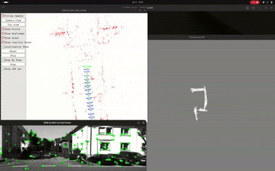
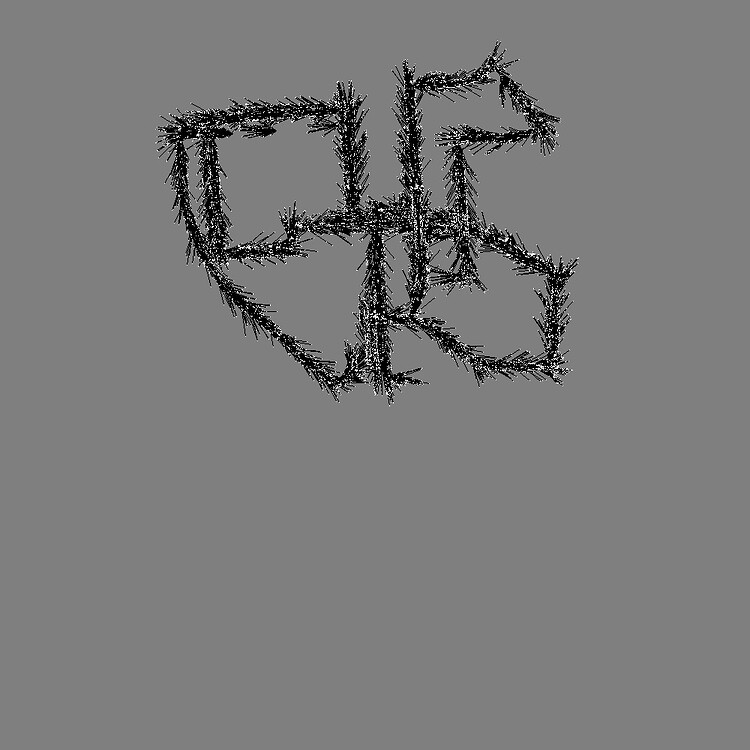

# ORBSLAM3-grid-mapper

**Version:** v1.0 | **Release:** July 2025 | **Author:** Harishma Prakash, Chennai Institute of Technology

---

## Overview

`ORBSLAM3-grid-mapper` is an extended version of the original [ORB-SLAM3](https://github.com/UZ-SLAMLab/ORB_SLAM3) framework.

This repository generates a **2D occupancy grid map** from the sparse map output of ORB-SLAM3 by running a background occupancy-grid generation thread alongside the SLAM process.

The generated outputs include:
- `.pgm` — occupancy grid map
- `.yaml` — occupancy metadata file

making the output directly compatible with **ROS2 navigation** workflows.

---

## Citation

If you find this work useful, please consider starring this repository and cite the original ORB-SLAM3:

```bibtex
@article{ORBSLAM3_TRO,
  title={{ORB-SLAM3}: An Accurate Open-Source Library for Visual, Visual-Inertial and Multi-Map {SLAM}},
  author={Campos, Carlos AND Elvira, Richard AND G\'omez, Juan J. AND Montiel, Jos\'e M. M. AND Tard\'os, Juan D.},
  journal={IEEE Transactions on Robotics},
  volume={37},
  number={6},
  pages={1874-1890},
  year={2021}
}
```

---

## Pre-requisites

Follow the original [ORB-SLAM3 repository](https://github.com/UZ-SLAMLab/ORB_SLAM3) for installation of all required dependencies and datasets.

---

## Tested Environments

| Component | Original ORB-SLAM3 | ORBSLAM3-grid-mapper |
|-----------|-------------------|----------------------|
| OS | Ubuntu 16.04 / 18.04 | Ubuntu 20.04.6 LTS |
| Compiler | C++11 / C++0x | C++14 / C++17 |
| GCC | GCC 5–7 | 9.4.0 |
| CMake | — | 3.16.3 |
| OpenCV | 3.2.0 | 4.3.0 |
| Eigen | Eigen3 | 3.3.7 |
| Pangolin | 2019–2020 era | Manually built (modern) |
| Python | 2.7 | — |

> ROS, g2o, and DBoW2 remain unchanged from the original ORB-SLAM3 setup.

---

## Building

```bash
git clone https://github.com/Harishma356/ORBSLAM3-grid-mapper.git
cd ORBSLAM3-grid-mapper
chmod +x build.sh
./build.sh
```

---

## Running

Execution commands are identical to the original ORB-SLAM3. Example — Monocular KITTI:

```bash
./Examples/Monocular/mono_kitti \
  Vocabulary/ORBvoc.txt \
  Examples/Monocular/KITTI00-02.yaml \
  PATH_TO_SEQUENCE_datainput
```

---

## Output

The mapper automatically generates during execution:

| File | Description |
|------|-------------|
| `global_occupancy_grid.pgm` | 2D occupancy grid image |
| `map.yaml` | ROS-compatible map metadata |

---

## Example Results

Occupancy grid generation during SLAM execution (KITTI dataset):



Comparison between direct sparse point flattening (general method) and the background thread approach used in this repository:

**General method output:**



**ORBSLAM3-grid-mapper output:**


## Acknowledgements

This repository is a modified version of [ORB-SLAM3](https://github.com/UZ-SLAMLab/ORB_SLAM3) 
developed by Carlos Campos, Richard Elvira, Juan J. Gómez, José M. M. Montiel, 
and Juan D. Tardós at the University of Zaragoza, extended with a 2D occupancy 
grid generation thread that converts sparse map points into an occupancy grid map.
